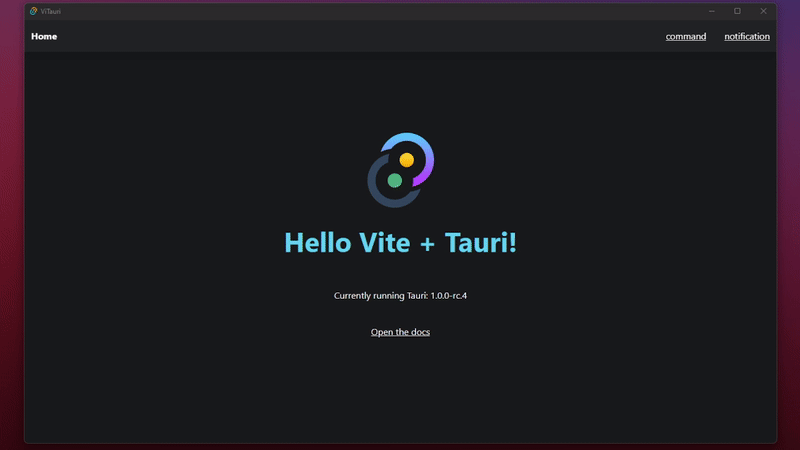

> DEPRECATED - Check [Nuxtor](https://github.com/NicolaSpadari/nuxtor), a spiritual successor of ViTauri made with Nuxt 3 and Tauri v2

<p align="center">
    
</p>

<h1 align="center"> ⚡ViTauri </h1>

<p align="center">
This is a starter template made with <a href="https://vitejs.dev">Vite</a> + <a href="https://tauri.studio">Tauri</a> + <a href="https://vuejs.org">Vue 3</a>
<br>
Build super fast desktop applications!
</p>


<br>

<div align="center">

</div>

<br><br>

## Technologies used

- Vite
- Vue 3
- UnoCSS
- Typescript + linting
- API auto import (you can add more or disable some in the `vite.config.ts` file) by `unplugin-auto-import`
- Components auto import by `unplugin-vue-components`
- Composables auto import by `vite-auto-import-resolvers`
- File system based routing by `vite-plugin-pages`
- Useful set of composable APIs by `@vueuse/core`

## Compatibility

This app is made with Windows in mind. Shell APIs will not work in other platforms, you might have to add checks or rework the commands yourself to make it work.

## Setup

  - This project uses [pnpm](https://pnpm.io). For a better development experience, I recommend using [@antfu/ni](https://github.com/antfu/ni). In alternative use a package manager of your choice.
  - Before running this app, you need to configure your environment. Take a look at the [tauri docs](https://tauri.studio/docs/getting-started/prerequisites/).
  - The program stops processes on port `8080` to run Vitauri. If you need that port, change it under the `server` section in the `vite.config.ts` and in the `scripts` section in `package.json`.

  ```sh
  # use this template
  $ npx degit NicolaSpadari/vitauri my-tauri-app

  # go into the folder
  $ cd my-tauri-app

  # install dependencies
  $ pnpm install # or just "ni"

  # start the project
  $ pnpm run dev # or just "nr dev"
  ```

  This will fire up two shells, one for Vite and one for Tauri, simultaneously. Your project will run in a new window when ready.

  To build the application:

  ```sh
  $ pnpm run build # or just "nr build"
  ```

## Debugging
Durind development you can simply open the console as you normally would in the browser during development.
<br>
You need to compile the app in debug mode to test it when you want to debug your built project:

```sh
$ pnpm run build:debug # or just "nr build:debug"
```

## Notes

I built this simple demo by wrapping `shell` and `notification` APIs in a composable.
<br>
If you don't need this, you can just remove it and call the functions directly, for example if you need to handle the output in a more specific way.
I'm also auto importing some of the APIs through `unplugin-auto-import`, if this creates confusion feel free to remove them and import them manually.

## License

MIT License © 2022-PRESENT [NicolaSpadari](https://github.com/NicolaSpadari)
